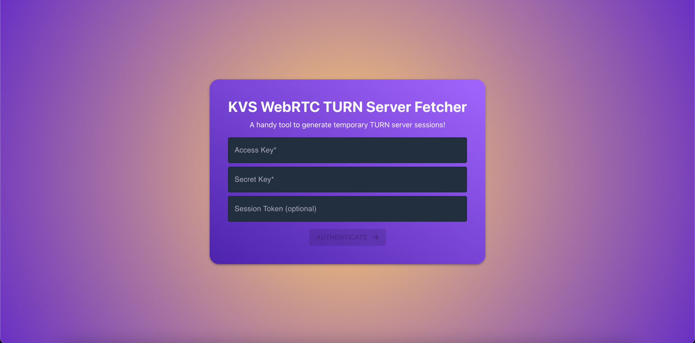
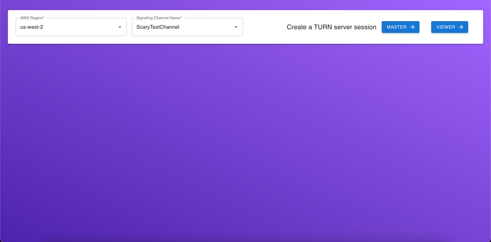
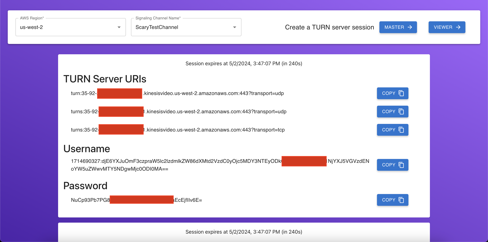

# KVS TURN Server Displayer

This repository hosts a web application developed in ReactJS utilizing TypeScript, designed to facilitate WebRTC (Real-Time Communication) applications seamlessly integrating with Amazon Kinesis Video Streams TURN servers.

The application leverages the [GetIceServerConfig API](https://docs.aws.amazon.com/kinesisvideostreams/latest/dg/API_signaling_GetIceServerConfig.html) from Amazon Kinesis Video Streams to dynamically fetch temporary TURN server session credentials including server URIs, username, and password.

WebRTC enables direct peer-to-peer communication between browsers or devices for audio, video, and data sharing. In scenarios where direct peer-to-peer connections are not feasible due to network restrictions (such as firewalls or NAT traversal issues), TURN (Traversal Using Relays around NAT) servers act as intermediaries.

The web application boasts an intuitive and easy-to-use UI, ensuring a seamless experience for developers. Copy buttons are strategically placed for quick access to TURN server credentials, streamlining the integration process.

## Getting started

1. Visit https://sirknightj.github.io/kvs-turn-server-display/

2. On the login screen, provide AWS Credentials.

3. Next, specify a region and your Signaling Channel.

4. Choose Master or Viewer.

5. Your TURN server session will be created and displayed on-screen. Choose the "Copy" buttons to copy the corresponding fields to your clipboard.

## Contributing

Contributions are welcome! Whether it's fixing bugs, adding new features, or improving documentation, feel free to submit pull requests to help enhance this project further.

## License

This project is licensed under the Apache-2.0 License.
